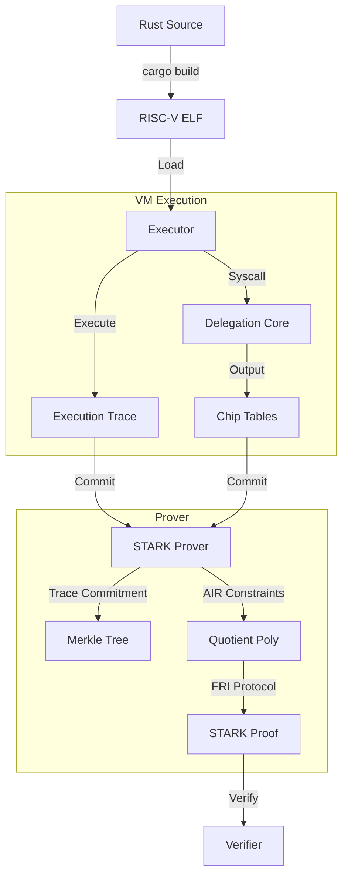

# ZP1: A High-Performance RISC-V zkVM based on M31 Circle STARKs

**Version**: 0.1.0-draft
**Date**: December 2025
**Author**: Zippel Labs

---

## Abstract

ZP1 is a next-generation Zero-Knowledge Virtual Machine (zkVM) designed to achieve the theoretical limits of proving performance on commodity hardware. While existing zkVMs utilize 64-bit primes (Goldilocks) or large 32-bit primes (BabyBear), ZP1 is the first production-grade system built natively on **Mersenne-31 ($2^{31}-1$)**. By leveraging **Circle STARKs** to solve the Fast Fourier Transform (FFT) domain inefficiencies traditionally associated with Mersenne primes, ZP1 delivers high-throughput verifiable computing for RISC-V programs. This architecture enables low-latency proving on standard CPUs and GPUs, reducing the cost of verifying complex computations—such as Ethereum transactions or cryptographic hash functions—by orders of magnitude.

---

## 1. Introduction

Zero-Knowledge Proofs (ZKPs) are the cornerstone of verifiable computing, enabling a prover to demonstrate the correctness of a computation without revealing its secrets or requiring re-execution. However, the adoption of ZKPs has been hindered by the "prover overhead" problem: generating a proof is typically $10^6$ to $10^9$ times slower than native execution.

### 1.1 The Field Selection Problem
The choice of the finite field determines the efficiency of the entire proving stack.
-   **Goldilocks ($2^{64} - 2^{32} + 1$)**: Used by Polygon zkEVM/Airbender. Excellent for 64-bit CPUs but suboptimal for 32-bit GPUs and mobile devices.
-   **BabyBear ($2^{31} - 2^{27} + 1$)**: Used by RISC0/SP1. A "nice" prime for FFTs, but requires overhead to handle the $2^{27}$ term during reduction.
-   **Mersenne-31 ($2^{31} - 1$)**: The ideal 32-bit field. Addition is a single instruction; multiplication is highly efficient. However, $p-1$ is not divisible by large powers of 2, making standard FFTs impossible.

### 1.2 The ZP1 Solution
ZP1 adopts **Mersenne-31 (M31)** as its base field to maximize arithmetic throughput on modern SIMD architectures (AVX-512, NEON) and GPUs. To overcome the FFT limitation, ZP1 utilizes the **Circle STARK** construction, mapping the computation trace to the unit circle $x^2 + y^2 = 1$ instead of a multiplicative subgroup. This allows efficient FFTs over domains of size $2^k$ within the M31 field, combining the fastest possible arithmetic with optimal algorithmic complexity.

---

## 2. System Architecture

ZP1 implements a full **compiler-to-proof** pipeline for the RISC-V instruction set.



### 2.1 The RISC-V Executor
The core of ZP1 is an optimized executor for the **RV32IM** instruction set (Integer + Multiplication). It accepts standard ELF binaries produced by `cargo build` or generic RISC-V toolchains.
-   **Trace Generation**: As the program executes, the executor records specific register states and memory operations into a trace matrix.
-   **Syscall Interception**: Heavy operations (SHA-256, Keccak) are intercepted and offloaded to the **Delegation Core**.

### 2.2 Memory Consistency (LogUp)
ZP1 replaces expensive Merkle-path memory arguments with a **LogUp permutation argument**. Memory access consistency is checked by ensuring that the multiset of "writes" (including initial values) equals the multiset of "reads" (including final values). LogUp reduces the constraint degree for these checks from extremely high (classic product arguments) to manageable fractional sums, enabling massive memory spaces without proportional proving cost.

### 2.3 The Prover Core
The prover transforms the execution trace into a cryptographic proof using the **Deep-ALI** (Deep Algebraic Linking consistency) protocol.
-   **Column Commitment**: The 77-column trace is committed using a Vector Commitment scheme (Merkle Tree over M31).
-   **Constraints (AIR)**: Algebraic Intermediate Representation constraints enforce the logic of RISC-V (e.g., `pc' = pc + 4`).
-   **Quotient Polynomial**: Constraints are combined and divided by the vanishing polynomial on the Circle Domain.
-   **FRI Protocol**: The **Fast Reed-Solomon Interactive Oracle Proof of Proximity (FRI)** is used to prove the quotient polynomial is low-degree.

---

## 3. Cryptographic Foundations

### 3.1 Mersenne-31 (M31)
The field $\mathbb{F}_p$ where $p = 2^{31} - 1$ offers unparalleled efficiency.
-   **Representation**: Elements fit exactly in a 32-bit signed integer.
-   **Addition**: `(a + b) % p` is `let c = a + b; if c >= p { c -= p }`. This is branchless and extremely fast on hardware.
-   **Multiplication**: The product of two 31-bit numbers fits in 62 bits, preventing overflow in standard 64-bit registers before reduction.

### 3.2 Circle STARKs
Traditional STARKs require the field size $p$ to satisfy $p = k \cdot 2^n + 1$ to use efficient Radix-2 FFTs. M31 does not satisfy this ($2^{31}-2$ is not divisible by 4).
Circle STARKs observe that while the *multiplicative group* of M31 is bad for FFTs, the set of points $(x, y)$ satisfying $x^2 + y^2 = 1$ forms a group with size $p + 1 = 2^{31}$.
-   **Consequence**: We can perform FFTs of size $2^n$ over this Circle Group.
-   **Result**: We get the "holy grail"—the speed of Mersenne arithmetic *and* the speed of power-of-two FFTs.

### 3.3 Security & Soundness (QM31)
A 31-bit field alone is too small for 128-bit security (birthday attack $\approx 2^{15.5}$).
ZP1 uses the **Secure Extension Field QM31**, a degree-4 extension of M31 ($p^4 \approx 2^{124}$).
-   **Challenge**: Secure challenge points (betas, gammas) are sampled from QM31.
-   **Folding**: The FRI protocol folds polynomials from QM31 down to the base field M31, preserving security while keeping the bulk of the computation in the fast base field.

---

## 4. Performance & Delegation

### 4.1 Benchmarks
Preliminary benchmarks on Apple M2 Max:

| Operation | Description | Throughput / Latency |
| :--- | :--- | :--- |
| **M31 Add** | Base field addition | ~0.55 ns |
| **M31 Mul** | Base field multiplication | ~0.62 ns |
| **Poseidon2** | Hash Permutation ($x^5$) | ~14.5 ns / round |
| **Hash Speed** | SHA-256 (Precompile) | ~543 MiB/s |
| **Hash Speed** | Blake2b (Precompile) | ~813 MiB/s |

### 4.2 The Delegation Advantage
Standard RISC-V is inefficient for heavy cryptography. A single Keccak-256 hash might take 100,000 CPU cycles.
ZP1 implements **Cryptographic Delegation**:
1.  **Detect**: The VM detects a syscall (e.g., `sys_keccak`).
2.  **Defer**: The VM records inputs/outputs in a separate "Chip Table" and continues.
3.  **Prove**: A specialized, highly optimized circuit proves the Chip Table validity.
4.  **Link**: A lookup argument ensures the main CPU trace inputs match the Chip Table.

**Impact**:
-   **Speedup**: ~100,000x for Keccak, SHA-256, and ECRECOVER compared to pure RISC-V execution.
-   **Trace Reduction**: A 500MB execution trace shrinks to ~10KB with delegation.

### 4.3 Comprehensive Competitive Matrix

We analyze the landscape across 11 critical architectural vectors to demonstrate ZP1's position as the *Mersenne-31 High-Performance Specialist*.

| Vector | **ZP1** | **SP1 (Succinct)** | **RISC Zero** | **Airbender** | **OpenVM** | **Jolt** |
| :--- | :--- | :--- | :--- | :--- | :--- | :--- |
| **1. ISA** | **RISC-V (RV32IM)** | RISC-V (RV32IM) | RISC-V (RV32IM) | RISC-V | Custom / Extensible | RISC-V (RV64) |
| **2. Field** | **Mersenne-31** | BabyBear | BabyBear | Goldilocks | Flexible Extension | Binary / 256-bit |
| **3. Arithmetization** | **AIR (LogUp)** | AIR (Plonky3) | AIR (Stark) | AIR | Halo2 / Custom | Lasso / Sumcheck |
| **4. Frontend** | **Rust (Cargo)** | Rust / LLVM | Rust / C++ | Rust | Rust | Rust |
| **5. Precompiles** | **Delegation (LogUp)** | Specialized Chips | Accelerator Circuits | Expected | Modular Extensions | Lasso Lookups |
| **6. GPU Backend** | **Metal (Native)** & CUDA | CUDA (Highly Opt.) | CUDA / Metal | CUDA | HAL (slower) | CPU Focused |
| **7. Continuations** | **Planned** | Shark Proofs | Yes (Bonsai) | planned | Yes | No |
| **8. Parallelization** | **Multi-threaded** | Distributed | Distributed | Distributed | Parallel | Linear Scan |
| **9. Verifier** | **STARK -> SNARK (Eth)** | Groth16 Wrapper | Groth16 Wrapper | STARK | Aggregation | Lasso Verifier |
| **10. Optimizations** | **Circle FFT** | Precompile Heavy | Continuation Heavy | Goldilocks Opt. | Modular | Lookup Heavy |
| **11. Benchmark** | **High-Throughput** | High-Throughput | High-Throughput | Latency Focused | Flexibility Focused | Fast Proving |

#### 4.3.1 Detailed Analysis of Key Vectors

1.  **Continuations & Parallelization**:
    *   **RISC Zero** pioneered continuations, allowing infinite execution by splitting proofs.
    *   **ZP1 Strategy**: ZP1 focuses currently on maximal throughput for *finite* constrained segments (e.g., Ethereum blocks) using M31 speed, with recursion/continuations as the next roadmap item.

2.  **GPU Acceleration Strategy**:
    *   **Market Standard**: Most zkVMs (SP1, Risc0) heavily optimize for NVIDIA CUDA.
    *   **ZP1 Differentiator**: ZP1 treats Apple **Metal** as a first-class citizen alongside CUDA. This allows decentralized proving on millions of consumer MacBooks, not just data center H100s.

3.  **Precompile Architecture**:
    *   **SP1/Risc0**: Specific circuits for SHA2/Keccak.
    *   **ZP1**: Uses a generic **LogUp** bus to connect *any* high-performance chip to the main CPU trace, allowing for a strictly modular "Delegation" architecture where the CPU doesn't even know the hash happened—it just verifies the IO result.

4.  **Arithmetization & Lookups**:
    *   **Jolt/Lasso**: revolutionized lookups but suffers from arithmetic overhead on non-binary fields.
    *   **ZP1**: Combines the best of both worlds—native integer arithmetic (M31) for logic + LogUp range checks for bitwise operations.

---

## 5. Integration

### 5.1 Ethereum
ZP1 is designed to verify Ethereum state transitions.
-   **Input**: Block header + Transactions + State Witnesses (Merkle Proofs).
-   **Process**: ZP1 loads the state, executes transactions in the zkVM, and computes the new state root.
-   **Output**: A ZK-Proof attesting that `Apply(OldRoot, Txs) -> NewRoot`.
The integration of `secp256k1` and `keccak` precompiles makes this economically viable, reducing gas costs for verification from massive amounts to a constant $\approx 250k - 500k$ gas (after SNARK wrapping).

### 5.2 Developer Flow
Developing on ZP1 feels like standard Rust development.

```rust
// main.rs
fn main() {
    // Read public inputs
    let n: u32 = zp1::io::read();
    
    // Compute expensive logic
    let result = fibonacci(n);
    
    // Commit output
    zp1::io::commit(&result);
}
```

Running `cargo prove` compiles this to RISC-V, executes it, and generates a zero-knowledge proof of the result.

---

## 6. Conclusion & Future Work

ZP1 represents a paradigm shift in zkVM design by proving that **Mersenne-31** is not only viable but superior for high-performance zero-knowledge proofs when paired with **Circle STARKs**. By solving the FFT domain structure problem with geometry rather than field size, ZP1 unlocks the full potential of modern hardware.

### Future Roadmap
1.  **Recursion**: Implementing segmented proofs to allow unbounded execution length and "Proof-of-Proof" compression.
2.  **JIT Trace Generation**: Accelerating the witness generation phase.
3.  **Hardware Decentralization**: Enabling proof generation on mobile devices and consumer laptops, democratizing the prover network.

---

**References**
1.  *Haböck, U. (2022). "Circle STARKs"*.
2.  *Ben-Sasson, E., et al. "FRI: Fast Reed-Solomon Interactive Oracle Proofs of Proximity"*.
3.  *Deep-ALI: "DEEP-Algebraic Linking Interactive Oracle Proofs"*.
